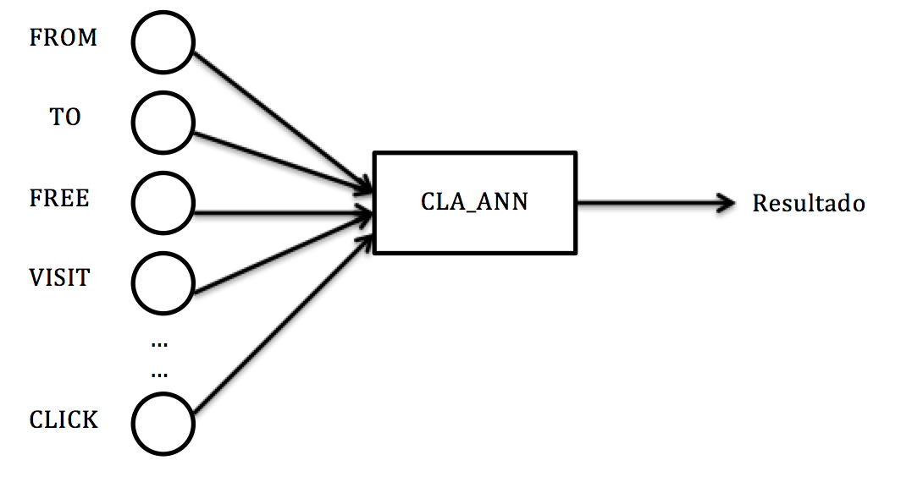

**Abstract**       
Existen diversos enfoques para la detección de spam que es enviado a lo largo y ancho de la red, desde enfoques legislativos hasta aquellos que implican un aprendizaje estadístico, que es en el que nos vamos a centrar en este trabajo. Concretamente, la técnica empleada consiste en analizar el contenido de un mensaje de correo electrónico para determinar si es spam o no. Para llevar a cabo esta solución nos hemos basado en el trabajo previamente realizado por [1], donde haciendo uso de una red neuronal artificial (ANN) se determina la naturaleza de un mensaje de correo.

#Introducción.      
El presente documento sirve como memoria para el trabajo desarrollado para la asignatura 'Redes Neuronales y aprendizaje estadistico' del master 'Tratamiento estadístico-computacional de la información'. Dicho documento se ha dividido de la siguiente forma:      

- ***Impacto del Spam***: donde brevemente explicaremos porque hemos seleccionado este tema como práctica final de la asignatura.    
- ***Solución planteada***: trataremos de dejar claro tanto enfoque como la solución planteada en el ejercicio.    
- ***Funcionamiento***: por si el lector estuviera interesado en realizar sus propias pruebas explicaremos como funciona la aplicación desarrollada.    
- ***Resultados obtenidos***: detallaremos el experimento realizado para evaluar la solución desarrollada.    
- ***Conclusiones y trabajo futuro***: comentaremos dificultades encontradas en la implementación del sistema, así como posibles mejoras si se quisiera profundizar más en el problema.    

#Impacto del Spam.       
El correo electrónico es una forma eficiente de comunicación que se ha adoptado globalmente tanto en indiviudos como en organizaciones. Hoy en día, más y más gente confía en dicho sistema para entablar comunicaciones entre amigos, familia, compañeros, clientes y asociados. Desgraciadamente, dicho extensión en su uso continuo lo ha llevado a ser considerado como una fuente de entrada a ciertas amenazas, en particular el conocido como spam o correo no solicitado se ha convertido en una amenaza dificil de detectar, la cual es recibida en un alto volumen. Según [2] en octubre del año 2006 el 67% del tráfico de correos electrónicos se correspondía con spam, subiendo del 57% del año anterior. El correo no deseado se ha convertido en un serio problema para los servicios de correo, de forma que es una dificil tarea encontrarse correos deseados en la carpeta de recibidos de nuestros sistemas. Hay que tener en cuenta que la existencia de spam es un problema económico para las empresas, ya que para las compañias provedoras de Internet supone una perdida en el ancho de banda, y para las organizaciones supone una perdida en la productividad de sus trabajadores. Es por esto que se ha convertido en un problema en auge que requiere la aplicación del aprendizaje estadístico, entre otras soluciones.        

#Solución planteada.      
La lucha por convertirse en el dominador en el servicio de correos electrónicos por parte de las mayores y mejores compañias de Internet, como Google, Yahoo o Microsoft, provocó que la detección de correos no deseados fuera un tema al que se le ha dedicado muchas horas de investigación. Basicamente y a grandes rasgos existen dos disciplinas, basadas en filtrar la dirección IP de origen y en filtrar el contenido del mensaje. La primera solución es muy solida pero la forma se saltar dicha defensa es muy sencilla, cosa que no ocurre con la segunda formula. Además, unido a la naturaleza de la asignatura impartida hemos escogido una solución basada en analizar el contenido del mensaje usando el entrenamiento del perceptron.   

Graficamente el esquema que hemos seguido para resolver el problema del filtrado de spam es el siguiente:   

  

donde cada neurona se correspondería con una palabra frecuente contenida en el mensaje a analizar, de forma que una vez fijadas las palabras a buscar en futuros mensajes, a tráves de una fase de entrenamiento, y sus pesos, mediante una simple formula que tiene en cuenta la cantidad de veces que aparece dicha palabra en un mensaje deseado y en uno considerado como spam, se podría obtener el valor total del peso en un mesaje, esto es la suma de los pesos de aquellas palabras que aparezcan en el mensaje a analizar. Con lo que si dicho peso final superara cierta umbral, establecido por el usuario, se determinaría si es considerado como mensaje deseado o como spam.    

La implementación de dicha solución se ha llevado a cabo en el lenguaje *R*, donde distinguimos cuatro módulos que pasamos a comentar.   

## Programa principal.   
El encargado de ejecutar el programa de filtrado de spam. Se puede encontrar en el fichero ***main.R***. Se correspondería con el siguiente pseudocódigo.
```{r, eval=FALSE}
Start training
For each message do
 Start cla_ann
End
Calculate statistics
```
En este modulo se debe establecer el número de neuronas de nuestra red (***num_node***), así como establecer una ruta válida que contenga los mensajes a analizar (***validation_set_directory***).    

## Entrenamiento.    
## CLA_ANN.    
## Entrenamiento.         


#Funcionamiento.       

#Resultados obtenidos.       
```{r}
summary(cars)
```

You can also embed plots, for example:

```{r, echo=FALSE}
plot(cars)
```

#Conclusiones y trabajo futuro.      


#Bibliografía.    
[1] A. T. Sabri, A. H. Mohammads, B. Al-Shargabi, M. A. Hamdeh. Developing New Continuous Learning Approach for Spam Detection using Artificial Neural Network (CLA_ANN). European Journal of Scientific Research ISSN 1450-216X Vol.42 No.3 (2010), pp.511-521.   
[2] MessageLabs. Threat Statistics. December 2006, [http://www.messagelabs.com/Threat_Watch/Threat_Statistics/](http://www.messagelabs.com/Threat_Watch/Threat_Statistics/).
